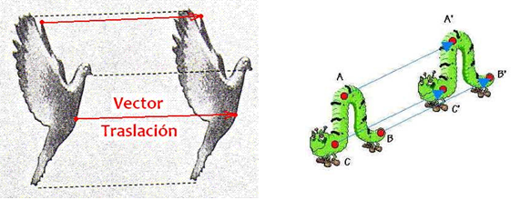
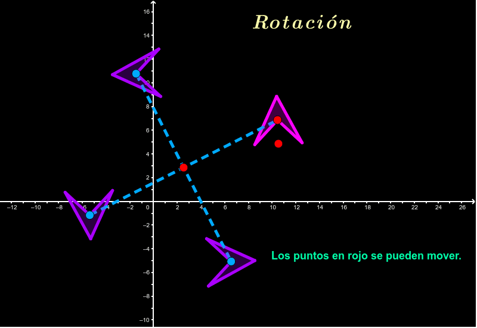
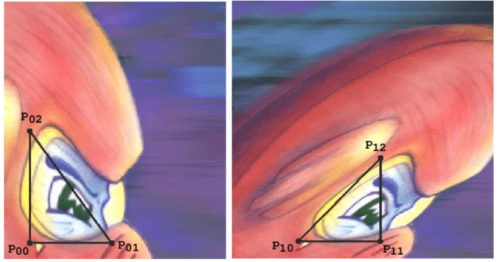
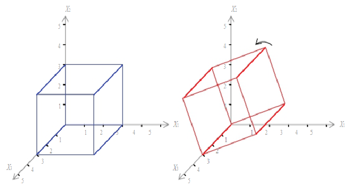
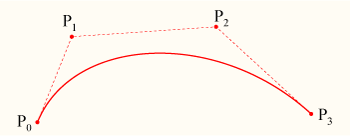
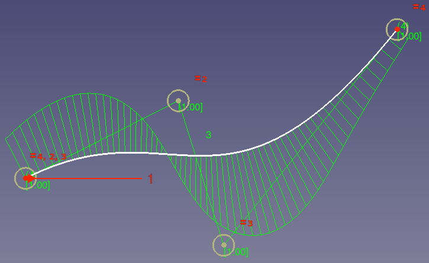
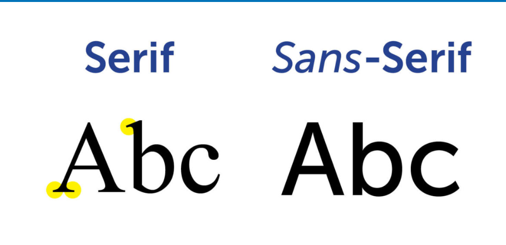

# UNIDAD 2 - GRAFICACIÓN 2D

## Datos generales

**Materia:** Graficación  
**Unidad:** Unidad 2 - Graficación 2D  
**Alumno:** Alondra Graciela Saavedra Miguel 
**Grupo:** G3  
**Docente:** Arístides Caballero Alfaro  

---

## Índice

- [Introducción](#introducción)
- [2.1 Transformación bidimensional](#21-transformación-bidimensional)
  - [2.1.1 Traslación](#211-traslación)
  - [2.1.2 Escalamiento](#212-escalamiento)
  - [2.1.3 Rotación](#213-rotación)
  - [2.1.4 Sesgado](#214-sesgado)
- [2.2 Representación matricial de las transformaciones bidimensionales](#22-representación-matricial-de-las-transformaciones-bidimensionales)
- [2.3 Trazo de líneas curvas](#23-trazo-de-líneas-curvas)
  - [2.3.1 Bézier](#231-bézier)
  - [2.3.2 B-spline](#232-b-spline)
- [2.4 Fractales](#24-fractales)
- [2.5 Uso y creación de fuentes de texto](#25-uso-y-creación-de-fuentes-de-texto)
- [Conclusión](#conclusión)
- [Referencias](#referencias)

---

## Introducción

La graficación 2D es una parte fundamental de la computación gráfica, ya que permite representar y manipular objetos en un plano de dos dimensiones. En esta unidad se estudian las transformaciones bidimensionales, la representación matricial de dichas transformaciones, el uso de curvas, fractales y fuentes de texto, los cuales son esenciales en el desarrollo de interfaces, videojuegos, animaciones y sistemas de diseño.

---

## 2.1 Transformación bidimensional

Las transformaciones bidimensionales son operaciones que permiten modificar la posición, tamaño, orientación o forma de un objeto en un plano 2D.

### 2.1.1 Traslación

La traslación consiste en mover un objeto sin alterar su forma ni tamaño.

**Fórmula:**

x' = x + tx  
y' = y + ty  

Donde:
- tx = desplazamiento en x  
- ty = desplazamiento en y  

**Ejemplo:**  
A(2,3) → A'(6,5)

---

### 2.1.2 Escalamiento

El escalamiento permite cambiar el tamaño de un objeto.

**Fórmula:**

x' = x · sx  
y' = y · sy  

Donde:
- sx = escala en x  
- sy = escala en y  

**Ejemplo:**  
A(2,3) → A'(4,6)

---

### 2.1.3 Rotación

La rotación permite girar un objeto alrededor del origen.

**Fórmula:**

x' = x cosθ - y sinθ  
y' = x sinθ + y cosθ  

---

### 2.1.4 Sesgado

El sesgado inclina la figura cambiando su forma.

**Fórmula:**

x' = x + shx · y  
y' = y + shy · x  

---

## 2.2 Representación matricial de las transformaciones bidimensionales

Las transformaciones se representan mediante matrices para facilitar cálculos.

**Traslación:**

|1 0 tx|  
|0 1 ty|  
|0 0 1 |

**Rotación:**

|cosθ -sinθ 0|  
|sinθ cosθ  0|  
|0    0     1|

**Escalamiento:**

|sx 0  0|  
|0  sy 0|  
|0  0  1|

---

## 2.3 Trazo de líneas curvas

Las curvas permiten representar formas suaves en gráficos.

### 2.3.1 Bézier

Curvas definidas por puntos de control.

**Características:**
- Suaves
- Fáciles de manipular
- Usadas en diseño gráfico

---

### 2.3.2 B-spline

Curvas más complejas con mayor control local.

**Características:**
- Más flexibles
- Mayor suavidad

---

## 2.4 Fractales

Los fractales son figuras que se repiten a diferentes escalas.

**Características:**
- Autosimilares
- Generados por algoritmos

**Ejemplos:**
- Sierpinski  
- Mandelbrot  

---

## 2.5 Uso y creación de fuentes de texto

Las fuentes de texto son esenciales en interfaces gráficas.

**Tipos:**
- Serif  
- Sans serif  
- Monoespaciadas  

**Importancia:**
- Mejoran la legibilidad  
- Dan estilo visual  

---

## Conclusión

Las transformaciones bidimensionales permiten manipular objetos en un plano de manera eficiente. El uso de matrices facilita su aplicación en la computación gráfica. Además, el uso de curvas, fractales y fuentes de texto permite crear gráficos más complejos y atractivos en aplicaciones digitales.

---

## Referencias

Foley, J. D., van Dam, A., Feiner, S. K., & Hughes, J. F. (1990). *Computer graphics: Principles and practice*.  

Hearn, D., & Baker, M. P. (2011). *Computer graphics with OpenGL*.  

Scribbr. (s. f.). https://www.scribbr.es/citar/generador-apa/
